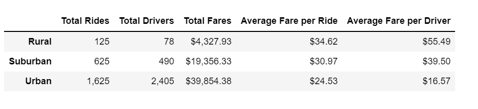

# PyBer_Analysis
Analyzing and visualizing ride share data across different city types.

## Resources
* software: Python 3.7.6, Jupyter Notebook

## Overview
Throughout this project we analyzed ride share data across rural, urban and suburban cities to gain an understanding of ridership and fare metrics. By creating visualizations of the Pyber data we were able to improve access to ridesharing services and dertermine afforability for underserved areas.

## Results

The dataframe above showcases the summary of total ride, total drivers, average fare per ride and average fare per ride split across the three city types. From here, we can conclude that rural cities have the highest average fare per driver and per ride, whereas the urban cities have the lowest average fare in both categories. It is evident that there is a large differentiation between the amount of drivers available in rural cities (78) as opposed to suburban (490) and urban (2405) cities. This differentiation then causes a higher average fare in rural cities as opposed to urban and suburban cities. 
The line graph below illustrates the the relationship of total fares from January through April 2019 in urban, suburban and rural cities. From here, we can see that urban cities consistently had the highest total fare by a long shot compared to suburban and rural cities. Between the months of February leading into March we can see a spike in fares across all three city types.

## Summary
This difference in data across city types is likely due to the low amount of ride and available drivers in those areas. My recommendation to the exectuives of Pyber would be to increase the amount of available drivers in rural areas to ensure they can meet the ride demand. With more available drivers the average ride fare should decrease which will encourage more riders to use Pyber. Additionally, due to a high demand of rides in urban cities, I would also recommend to increase driver count . It is evident that urban cities host the majority of Pybers customers, so adding more drivers to those areas will increase overall customer experience.
